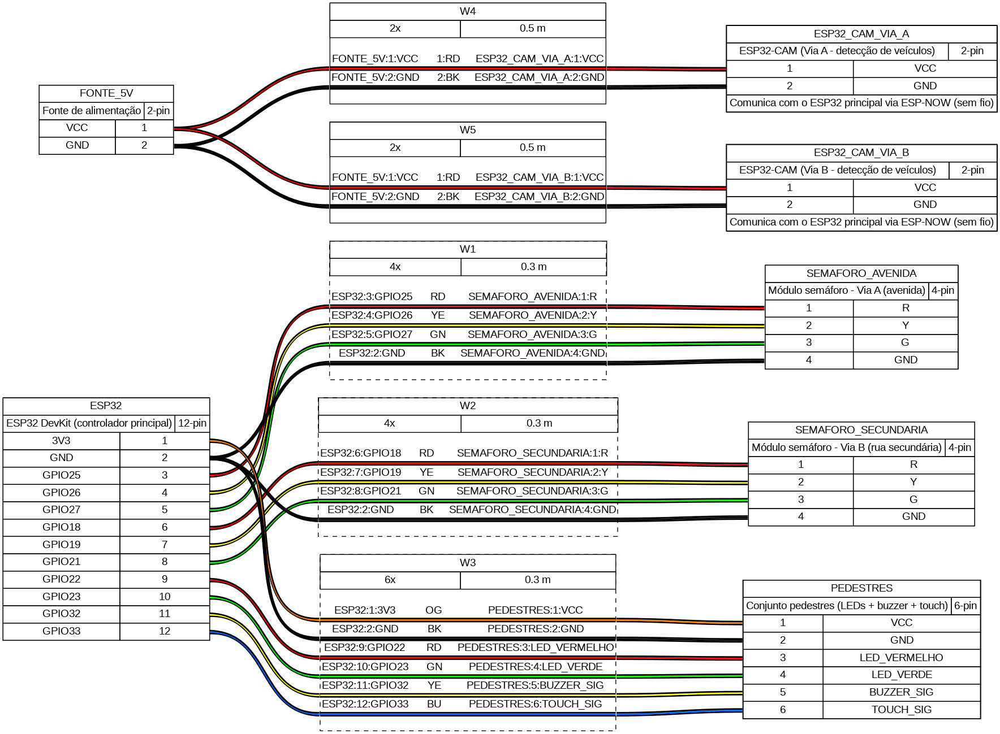

# Hardware

This document describes the hardware required to reproduce the Smart Traffic Light prototype, including the bill of materials, wiring concept, and GPIO configuration.

---

## 1. Bill of Materials

The following components are required to reproduce the prototype.

| Component | Quantity | Purpose |
|---|---:|---|
| ESP32 DevKit V1 | 1 | Main traffic light controller |
| ESP32-CAM | 2 | Camera for roads |
| Red LED | 3 | Vehicle and pedestrian signaling |
| Yellow LED | 2 | Vehicle traffic lights |
| Green LED | 3 | Vehicle and pedestrian signaling |
| Push button or touch sensor | 1 | Pedestrian crossing request |
| Buzzer | 1 | Audible pedestrian signal |
| Breadboard | 1+ | Circuit assembly |
| Jumper wires | As required | Electrical connections |
| USB cables | As required | Programming and power |
| Power supply | As required | System power |
| Resistors | As required | LED current limiting |

The physical prototype represents a two-road intersection.

---

## 2. System Components

The hardware is divided into three main groups.

### Camera System

```text
AI-Thinker ESP32-CAM
Freenove ESP32-S3-EYE
```

These devices capture images of the two monitored roads.

> You can use any ESP-compatible camera model you prefer.

### Main Controller

```text
ESP32 DevKit V1
```

The main ESP32 executes the traffic control algorithm and controls the physical signaling.

### Actuators

```text
Vehicle traffic lights
Pedestrian LEDs
Pedestrian button
Buzzer
```

---

## 3. Physical Layout

The prototype represents a simplified intersection with two monitored roads.

```text
                 ROAD A
                   |
                   |
              [Camera 1]
                   |
                   v
          +----------------+
          |                |
          |  INTERSECTION  |
          |                |
          +----------------+
                   |
                   |
              [Camera 2]
                   |
                   |
                 ROAD B
```

Each camera is positioned to monitor the traffic queue on its corresponding road.

The exact physical positioning affects the quality of the computer vision model and should be kept reasonably consistent with the conditions used during dataset collection.

---

## 4. Vehicle Traffic Lights

Each road has a traffic light represented by:

```text
RED
YELLOW
GREEN
```

Therefore, the vehicle signaling system requires:

```text
Road A:
- Red
- Yellow
- Green

Road B:
- Red
- Yellow
- Green
```

The LEDs are controlled by GPIO outputs on the main ESP32.

---

## 5. Pedestrian Signaling

The pedestrian system contains:

```text
Pedestrian Red LED
Pedestrian Green LED
Pedestrian Button
Buzzer
```

The button is configured as an input.

The LEDs and buzzer are configured as outputs.

---

## 6. Main ESP32 GPIO Configuration

The exact GPIO assignments must match the values defined in:

```text
../esp32/main/main_esp.ino
```

The table below should be kept synchronized with the source code.

| Component | Recommended GPIO | Variable in Code | Direction | Function |
|---|---|---|---|---|
| Road A Red LED (Avenue - Red) | 18 | AVENUE_RED | OUTPUT | Red signal for Avenue |
| Road A Yellow LED (Avenue - Yellow) | 19 | AVENUE_YELLOW | OUTPUT | Yellow signal for Avenue |
| Road A Green LED (Avenue - Green) | 21 | AVENUE_GREEN | OUTPUT | Green signal for Avenue |
| Road B Red LED (Secondary - Red) | 25 | ROAD_RED | OUTPUT | Red signal for Secondary road |
| Road B Yellow LED (Secondary - Yellow) | 26 | ROAD_YELLOW | OUTPUT | Yellow signal for Secondary road |
| Road B Green LED (Secondary - Green) | 27 | ROAD_GREEN | OUTPUT | Green signal for Secondary road |
| Pedestrian Red LED | 22 | PEDESTRIAN_RED | OUTPUT | Pedestrian stop signal |
| Pedestrian Green LED | 23 | PEDESTRIAN_GREEN | OUTPUT | Pedestrian crossing signal |
| Pedestrian Button (Touch) | 33 | TOUCH_PIN | INPUT | Crossing request |
| Buzzer | 32 | BUZZER | OUTPUT | Audible crossing indicator |

> **Important:** Do not select GPIO numbers based on this documentation alone. Always verify the current definitions in `main_esp.ino` before wiring the circuit.

Wiring schema:



---

## 7. GPIO Wiring

A typical LED connection follows:

```text
ESP32 GPIO
    |
    |
 Resistor
    |
    |
  LED
    |
    |
   GND
```

The resistor is required to limit the current through the LED.

For the pedestrian button:

```text
ESP32 GPIO
    |
    |
 Push Button
    |
    |
   GND
```

The input configuration used by the firmware must match the electrical wiring.

For example, if the firmware uses an internal pull-up resistor, the button can be connected between the GPIO and GND.

---

## 8. Buzzer

The buzzer is connected to a GPIO configured as an output.

```text
ESP32 GPIO
    |
    |
  Buzzer
    |
    |
   GND
```

The firmware activates the buzzer during the pedestrian crossing period.

The buzzer remains active for the configured crossing duration.

---

## 9. Recommended Assembly Procedure

Build the circuit in the following order.

### Step 1 — Main ESP32

Connect the ESP32 DevKit V1 to the breadboard.

Do not connect all components simultaneously during the first test.

### Step 2 — Vehicle LEDs

Connect the six vehicle LEDs:

```text
Road A:
RED
YELLOW
GREEN

Road B:
RED
YELLOW
GREEN
```

Use the GPIO table from `main_esp.ino`.

Test each LED independently before continuing.

### Step 3 — Pedestrian LEDs

Connect:

```text
Pedestrian RED
Pedestrian GREEN
```

Verify that the two LEDs can be controlled independently.

### Step 4 — Pedestrian Button

Connect the push button to its configured GPIO.

Test that pressing the button is correctly detected by the ESP32.

### Step 5 — Buzzer

Connect the buzzer to the configured GPIO.

Verify that it activates when the pedestrian crossing sequence begins.

### Step 6 — Cameras

Connect and power the two camera devices:

```text
AI-Thinker ESP32-CAM
Freenove ESP32-S3-EYE
```

The two cameras use different firmware implementations.

Do not upload the AI-Thinker firmware to the Freenove board or vice versa.

---

## 10. Camera Configuration

The project uses two different camera platforms:

| Camera | Board | Firmware |
|---|---|---|
| Camera 1 | AI-Thinker ESP32-CAM | `../esp32/camera-1/cam_aithinker.ino` |
| Camera 2 | Freenove ESP32-S3-EYE | `../esp32/camera-2/cam_freenove.ino` |

Because the boards have different hardware configurations, their camera initialization code is maintained separately.

---

## 11. Power Considerations

The ESP32 devices and peripheral components must be powered using an appropriate power source.

Avoid powering a large number of peripherals directly from a GPIO pin.

GPIOs should be used as control signals rather than as general-purpose power supplies.

For a larger or production-oriented implementation, appropriate transistor or driver circuits should be used for loads that exceed the GPIO electrical limits.

---

## 12. Communication Wiring

The camera modules communicate wirelessly with the rest of the system.

No physical data cable is required between the cameras and the main controller.

The communication architecture uses:

```text
Camera
   |
   | Wi-Fi / HTTP
   v
Computer Vision API
   |
   | Detection information
   v
Main ESP32
   |
   | ESP-NOW where configured
   v
Traffic Control
```

---

## 13. Configuration Checklist

Before powering the complete system, verify:

- [ ] All LEDs have appropriate current-limiting resistors.
- [ ] All LED grounds are connected correctly.
- [ ] The pedestrian button is connected to the correct GPIO.
- [ ] The buzzer is connected to the correct GPIO.
- [ ] GPIO assignments match `main_esp.ino`.
- [ ] AI-Thinker firmware is installed on the AI-Thinker board.
- [ ] Freenove firmware is installed on the Freenove board.
- [ ] Wi-Fi credentials are configured.
- [ ] API URL is configured.
- [ ] ESP-NOW peer MAC address is configured.
- [ ] ESP-NOW channel configuration is correct.
- [ ] The API is reachable from the ESP32 devices.

---

## 14. Important Prototype Note

This hardware represents a low-voltage academic prototype.

The LEDs represent vehicle traffic lights and pedestrian signals rather than controlling real traffic infrastructure.

The timing and control parameters were adapted for demonstration purposes and should not be directly applied to real-world traffic systems.